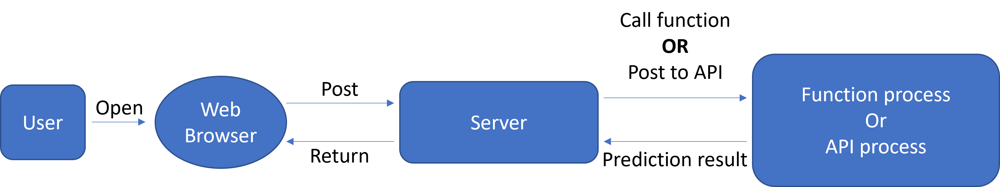

# 1. Problem Statement

## 1.1 Definition

When users post an image to the web interface through the frontend, the server return a page showing the category of the image.

## 1.2 Motivation

With the rapid development of the machine learning and deep learning, it can help us do more and more things in people's daily life, such as image recognition, editing a picture etc. But due to the limitation of the computing  resource, people prefer to use a website interface, which is accessible from any device with an internet connection.

Therefore, we'd like to implement an image-recognition service, which can classify the image posted by a user and return the results, and to analyze some experiments on it.


# 2. Design

## 2.1 Setup diagram



As shown in the picture, it shows how the server works when a user posts an image to the server through a browser, our server is built by `python` and `Django`. 

1. User opens a browser and enter in the address ```ip:8000/classifer```, and then posts an image to the web server as an ```ImageForm``` through the submit button. The `ImageForm` is a custom form contains an  `ImageField` type image.

2. When the server received the post form from the user, it will save it to the database. To get the category of the image, we have two choices:

   a. Call a function named `inceptionClassifier` in the server, it will return the image-recognition result from an `inception-v3` model.

   b.  Post this image to an API named `ip/api/imgclass`, which is deployed in another server, the API will return the result.

3. After getting the result, the server will format it and then render the website with it, the user will an updated page showing the image and its category.

## 2.2 Environment

Our server is deployed in `Django` framework, and uses CPU-based `pytorch` to load the `inception-v3` model to classify the image.


# 3 Usage


Enter http://164.67.126.52:8000/classifier  in a browser.


# 4. Working demo video

https://drive.google.com/file/d/1GF9EHExchv_xH9I1u3ZydbKMVgvQlBO5/view?usp=sharing


# 5. Reproducibility

### 5.1 scripts to setup the experiment

After reserved resource in GENI and connected to the server via SSH, run 

``` bash
git clone https://github.com/Julymycin/django-image-recognition.git
cd django-image-recognition
```

to download the repo and enter the folder.

Then run

``` bash
source setup.sh
```

The webserver will run in the background.

Enter `<the public ip address of server>:8000/classifier` in a browser, you can see the page to recognize your images.

### 5.2 code

https://github.com/Julymycin/django-image-recognition

### 5.3 Rspec files

https://drive.google.com/file/d/1zLcfodUJ56glDNeuqDvkCvKoW2Au7QoK/view?usp=sharing

### 5.4 Reproduce

Has been set in the setup.sh, or run commands:

```bash
cd django-image-recognition
nohup python manage.py runserver 0.0.0.0:8000 &
```


